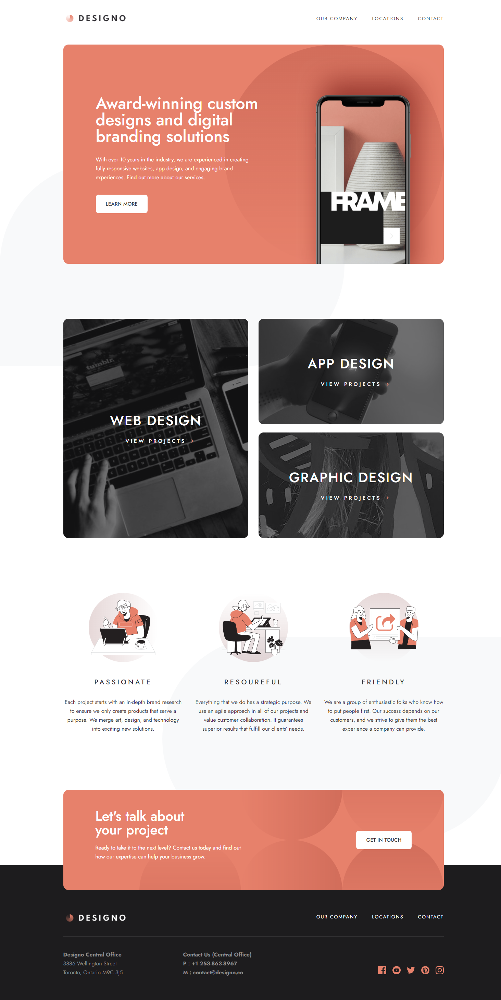
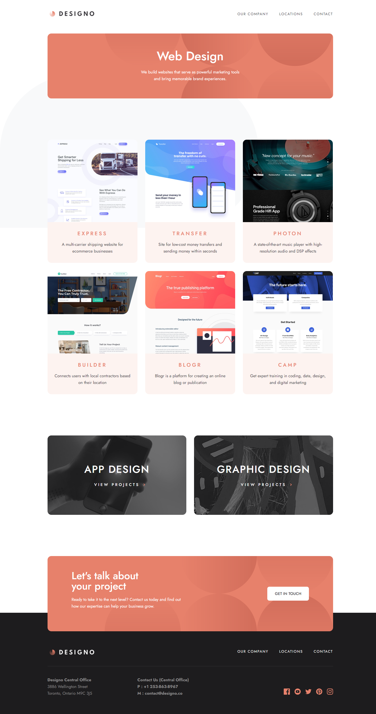
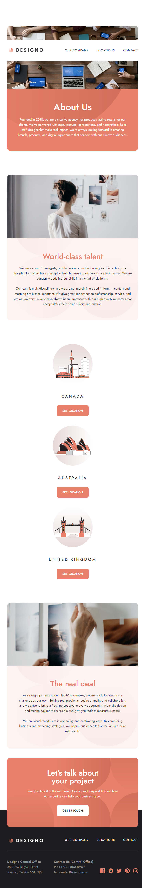
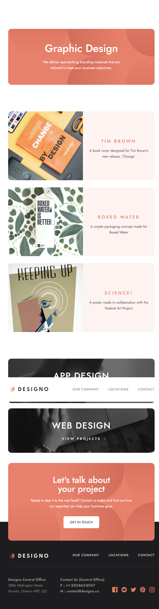
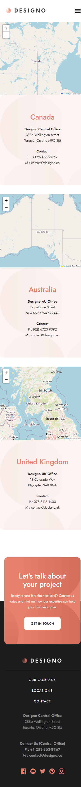
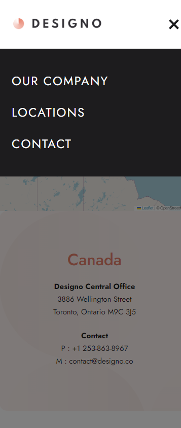

# Frontend Mentor - Designo agency website solution

This is a solution to the [Designo agency website challenge on Frontend Mentor](https://www.frontendmentor.io/challenges/designo-multipage-website-G48K6rfUT). Frontend Mentor challenges help you improve your coding skills by building realistic projects. 

### The challenge

Users should be able to:

- View the optimal layout for each page depending on their device's screen size
- See hover states for all interactive elements throughout the site
- Receive an error message when the contact form is submitted if:
  - The `Name`, `Email Address` or `Your Message` fields are empty should show "Can't be empty"
  - The `Email Address` is not formatted correctly should show "Please use a valid email address"
- **Bonus**: View actual locations on the locations page maps (we recommend [Leaflet JS](https://leafletjs.com/) for this)

### Screenshot

Behold, my Designo multi-page website solution's screenshot! Delighted to present this visually captivating design, thoughtfully crafted with a seamless user experience. Embracing various elements, the site boasts multiple pages showcasing product highlights, captivating imagery, and intuitive navigation. It reflects my meticulous attention to detail and passion for web design. The color scheme complements the brand identity, evoking an elegant and modern feel. User feedback played a crucial role in refining the layout and ensuring responsiveness across devices. This achievement marks a significant milestone in my journey as a frontend developer, and I'm excited to continue pushing boundaries!

### Links

- Live Site URL: [Designo Multi-page Website](https://designo-multi-page-website-phi.vercel.app)

### Built with

- HTML5
- SASS/SCSS
- Vanilla Javascript
- LeafletJS
 project in the future.**

## Author

- Website - [Jownsu](https://jownsu.github.io/)
- Frontend Mentor - [@jownsu](https://www.frontendmentor.io/profile/jownsu)
- Instagram - [jownsu](https://www.instagram.com/jownsu/)
- Linked In - [Jhones](https://www.linkedin.com/in/jhones-digno-866904213/)